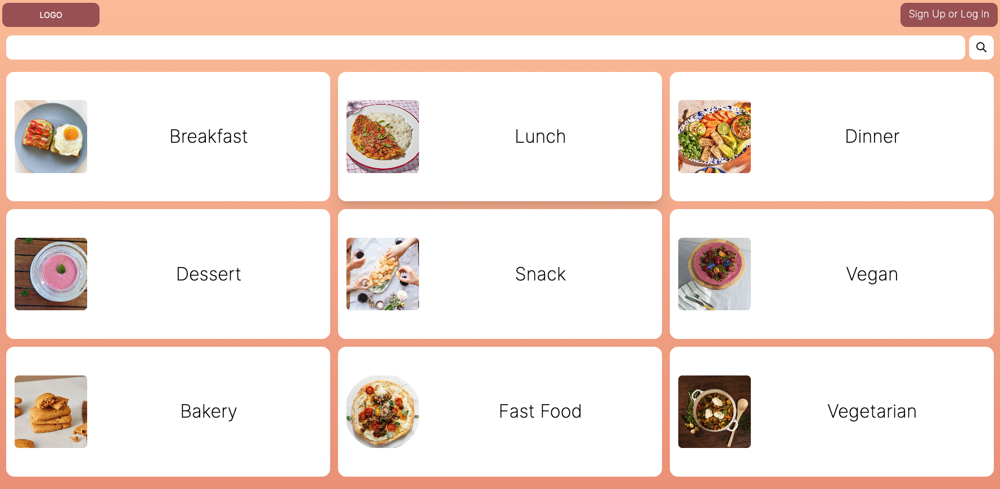

# Chef's Choice

## Description

Introducing “Chef’s Choice” – a recipe bank that holds a plethora of recipes added by a variety of users. The recipes are all categorized by type of meal and/or preference of meal. Once you’ve chosen your meal, you can then use the embedded link to purchase the ingredients on the Walmart website.

Other actions that users can perform include viewing and posting on recipes. One caveat to this is the login feature. While users can view any receipe, an account is required in order to post a recipe.

We created this website as a companion website to the FitnessLIND app. In this regard, we are able to create a recipe database that could be a viable option for a healthy and balanced diet.

I mean, don’t get me wrong, we love to eat, too! (Don’t worry, desserts were included in the seeding process!)

Since this website is a work in progress, we also some ideas we hope to implement in the future, which includes:

### User Profile Additions

-   including profile information, picture option(s) and other customization options into the User model
-   the ability to have users save their recipe to view later or favourite it
-   a categorization drop-down on the user profile, which sorts recipes by tag (meal type / preference)

### Some Feature/Functionality Additions

-   Inserting a comment system
-   Rating system to rate the recipe
-   Inclusion of nutrition facts
-   Having a functional search bar
-   Accessing any users profile and recipes
-   Creating an in-house purchase system

## Table of Contents

-   [Installation](#installation)
-   [Usage](#usage)
-   [Credits](#credits)
-   [License](#license)

## Installation

In order to get the development environment running, you would need to install the dependencies using "npm install". Do not forget to set the environment variable (.env) in your configuration.

Once you've installed the dependencies, you will need to run "mysql" and connect to the database.

Then you would need "npm run seed" to import the seed data into your database.

Once all this is completed, you can then start the server, and listen in on the port.

## Usage

When the server is up and running, you will see the homepage for Chef's Choice:

When you click on one of the tags, such as "Breakfast", you will then be navigated to all the options contained within the tag:

When you click on your chosen recipe, you will be redirected to the recipe:

If you want to post your own recipe, you would need to login in, which looks like this:

Once logged in, the landing page header changes to include an "Add Recipe" button and a "Profile" button:

The Add Recipe button will lead you to a insertion form, which will look like this:

You can also take a look at all the receipes create by a user by choosing their profile page:

## Credits

### Collaborators

This app was made in collaboration with:

1. Ilya Evlanov - GitHub Repo: [https://github.com/bambolelooo]
2. Wei-Chi Fang - GitHub Repo: [https://github.com/WeitheFang]
3. Girdika Godwin - GitHub Repo: [https://github.com/godwingi]

### Attributions

#### Hamburger Profile Picture:

-   <a href="https://www.freepik.com/free-photo/man-eats-greedily-delicious-hamburger-feels-very-hungry-consumes-fast-food-wears-round-spectacles-jumper_16075283.htm#query=person%20eating&position=1&from_view=keyword">Image by wayhomestudio</a> on Freepik

#### Icons

-   Delete Icon in Glyph Style by Alex Martynov
-   Edit Icon in Glyph Style by Google Inc.
-   Share Icon in Glyph Style by Google Inc.

### Tutorials

-   Cloudinary: <a href="https://www.youtube.com/watch?v=3o1Z5N9TeuQ&t=567s">How to Upload Images to Cloudinary (using REACT JS & Node JS )</a>

## License

N/A
